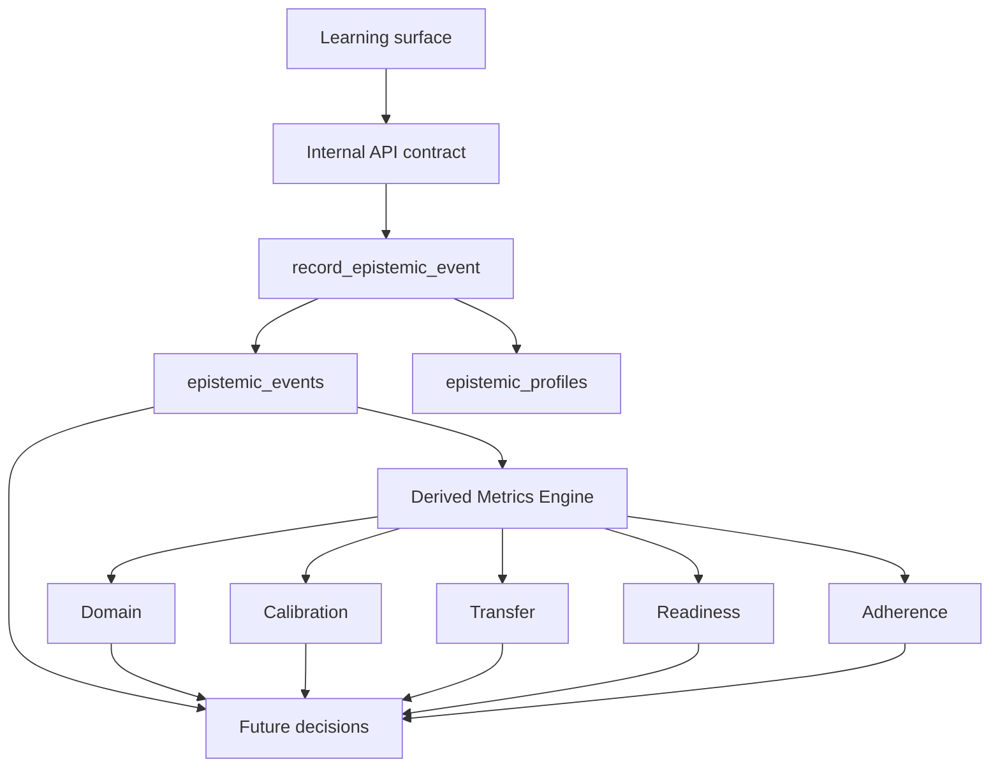

# EP-01 Epistemic Profile Technical Architecture

## Objective

Build the backend contract for the Epistemic Profile without implementing Bottle Guided, Label Guided, Mentor, Dashboard, or new frontend surfaces.

The Epistemic Profile is an evidence database. Events are the only source of truth. Evidence produces derived metrics. Derived metrics inform decisions. No derived metric is stored.

## Core Principle

Events are the only source of truth. No derived metric is stored.

Persistent storage is limited to:

- profile envelope and version state;
- append-only events;
- optional links from events to existing attempts or sessions.

Derived metrics are computed at read time from `epistemic_events`.

## Diagram



## Tables

### `public.epistemic_profiles`

One row per learner. This is a durable envelope, not a score table.

Columns:

- `user_id`: learner profile id.
- `profile_version`: contract version, initially `EP-01`.
- `status`: `active` or `archived`.
- `evidence_cursor`: non-derived JSON object for synchronization cursors.
- `created_at`, `updated_at`.

Not allowed:

- domain score;
- calibration score;
- transfer score;
- readiness score;
- adherence score;
- any cached metrics object.

### `public.epistemic_events`

Append-only event ledger. This is the canonical evidence source.

Columns:

- `id`: server uuid.
- `user_id`: learner id.
- `event_id`: client or upstream idempotency key.
- `event_type`: controlled event enum.
- `source_experience`: producing subsystem.
- `source_mode`: producing mode.
- `occurred_at`: event time.
- `payload`: observed action data.
- `evidence`: outcome or evidence data.
- `metadata`: non-pedagogical operational context.
- `schema_version`: contract version.
- `created_at`.

Integrity:

- unique `(user_id, event_id)`;
- JSON object checks for `payload`, `evidence`, and `metadata`;
- RLS owner/admin read and insert;
- no authenticated update/delete policy.

### `public.epistemic_event_links`

Optional links from events to existing evidence rows.

Allowed `related_table` values:

- `learning_events`
- `sat_attempts`
- `open_response_attempts`
- `access_audit_events`
- `external`

## Events

Supported EP-01 event types:

- `decision_made`
- `confidence_selected`
- `simulation_completed`
- `misconception_detected`
- `misconception_resolved`
- `novel_item_presented`
- `practice_completed`
- `session_completed`
- `time_expired`

Events must be idempotent by `(user_id, event_id)`.

## Signals

Signals are not stored separately in EP-01. They are interpretive groupings over events:

- decision quality signal from `decision_made`;
- calibration signal from `confidence_selected`;
- transfer signal from `novel_item_presented` and `practice_completed`;
- readiness signal from `simulation_completed` and `session_completed`;
- adherence signal from `practice_completed`, `session_completed`, and `time_expired`.

## Derived Metrics

The derived metrics engine lives in:

`shared/epistemic-profile-metrics.js`

It exports:

- `EVENT_TYPES`
- `METRIC_KEYS`
- `validateEpistemicEvent`
- `normalizeEvents`
- `deriveEpistemicMetrics`

Metrics:

- `domain`
- `calibration`
- `transfer`
- `readiness`
- `adherence`

Each metric returns:

- `value`: number from `0` to `1`, or `null` when evidence is insufficient;
- `evidence_count`;
- `status`;
- `source_event_types`.

The engine is intentionally simple. It provides deterministic infrastructure, not final pedagogy.

## API Contract

No public frontend route is implemented in EP-01. These are internal contracts for future Edge Functions.

### `POST /functions/v1/record-epistemic-event`

Purpose:

Append one event to the learner evidence ledger.

Backend primitive:

`public.record_epistemic_event(...)`

Required input:

- `event_id`
- `event_type`
- `source_experience`
- `source_mode`
- `occurred_at`
- `payload`
- `evidence`
- `metadata`

Response:

```json
{
  "inserted": true,
  "epistemic_event_id": "uuid"
}
```

Duplicate response:

```json
{
  "inserted": false
}
```

### `GET /functions/v1/get-epistemic-profile`

Purpose:

Return profile envelope plus derived metrics computed from `epistemic_events`.

Reads:

- `epistemic_profiles`
- `epistemic_events`
- `epistemic_event_links`

Must not read or expose official scoring keys.

## Integration Plan

1. Bottle Guided records events through `record_epistemic_event`.
2. Label Guided records events through the same contract.
3. Full Simulation emits `simulation_completed` and component events.
4. Mentor reads derived metrics and supporting evidence, not stored scores.
5. Dashboard reads derived metrics snapshots computed at request time.
6. Analytics can aggregate events with service-role jobs, but must not write derived metrics back into the profile tables.

## Rollback

Rollback is schema-only:

```sql
drop function if exists public.record_epistemic_event(
  text,
  text,
  text,
  text,
  timestamptz,
  jsonb,
  jsonb,
  jsonb
);

drop table if exists public.epistemic_event_links cascade;
drop table if exists public.epistemic_events cascade;
drop table if exists public.epistemic_profiles cascade;
```

Existing SAT, SBA, OR, auth, and access tables are not modified by EP-01.
